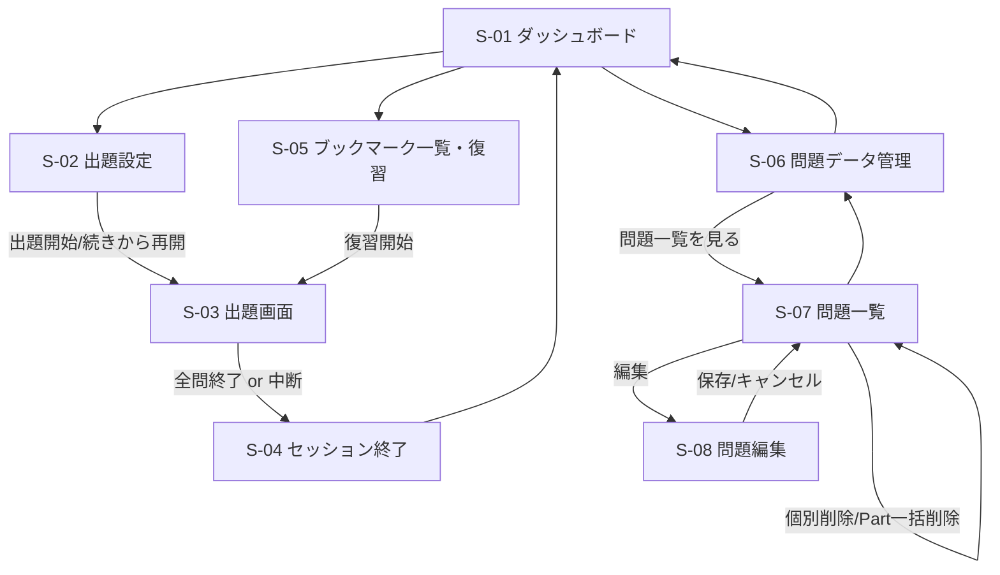

# TOEIC-drill 基本設計書(外部設計)

- 文書ステータス: 確定
- 作成日: 2026-07-31
- 更新日: 2026-08-02(データベースをSQLite+PrismaからFirebase Realtime Databaseに変更。既存のFirebaseアカウント・Web公開を見据えた変更)
- 前提: [01_requirements.md](./01_requirements.md) の内容に基づく

## 1. 技術スタック

| 区分 | 採用技術 | 理由 |
|---|---|---|
| フロントエンド/バックエンド | Next.js(App Router) + TypeScript | 1つのプロジェクトでUIとAPI(Server Actions)を完結できる |
| データベース | Firebase Realtime Database | 既存のFirebaseアカウントをそのまま利用できる。外部に永続化されるため、Web公開先(Cloud Run等)のステートレスなファイルシステムに影響されない |
| DBアクセス | Firebase JS SDK(`firebase/database`) | サーバー側(Server Actions/Server Components)から直接呼び出す。認証は行わず、セキュリティルールを全公開にして鍵なしで接続する(個人利用のため) |
| スタイリング | Tailwind CSS | 学習コストが低く、実装が速い |
| 対応デバイス | PCブラウザ + スマートフォン(レスポンシブ・タッチ対応) | 外出先でも学習できるよう対応(2026-07-31変更。当初はPC専用) |
| デプロイ先 | Firebase App Hosting | 既存のFirebaseアカウントを利用([04_deployment.md](./04_deployment.md)参照) |

## 2. システム構成

```mermaid
flowchart LR
    User[利用者(ブラウザ)] --> UI[Next.js フロントエンド]
    UI --> API[Next.js Server Actions / Server Components]
    API --> SDK[Firebase JS SDK]
    SDK --> RTDB[(Firebase\nRealtime Database)]
```

- Next.jsのServer Actions/Server ComponentsからFirebase JS SDKを使い、Realtime Databaseに直接読み書きする
- 問題データ・解答履歴・ブックマークはすべてRealtime Databaseに永続化されるため、アプリのホスト環境(ローカル/Cloud Run等)がステートレスであっても消えない
- セキュリティルールは`.read: true, .write: true`(全公開)。個人利用アプリのため認証機構は設けない

## 3. 画面一覧

| ID | 画面名 | 概要 |
|---|---|---|
| S-01 | ダッシュボード(トップ) | 直近の学習状況(累計回答数・正答率・ブックマーク数など)を表示。各機能への導線を配置 |
| S-02 | 出題設定画面 | 出題するPart(複数選択)を選び、出題を開始する。進行中のセッションがあれば「続きから再開」を表示 |
| S-03 | 出題画面 | 問題文・選択肢を表示し、回答→正誤表示→解説(あれば)→「次へ」ボタンで次の問題に進む |
| S-04 | セッション終了画面 | 出題範囲を終えた/中断した際に、今回の正答数・誤答数のサマリーを表示 |
| S-05 | ブックマーク一覧・復習画面 | ブックマークされた問題の一覧を表示し、そこから復習セッション(S-03と同様の出題画面)を開始できる |
| S-06 | 問題データ管理画面 | 問題データファイルのアップロード、登録済み問題数のPart別内訳を確認。問題一覧画面への導線を配置 |
| S-07 | 問題一覧画面 | 登録済み全問題をテーブル形式で一覧表示。Part単位の一括削除ボタンを配置。行ごとに編集・個別削除への導線を配置 |
| S-08 | 問題編集画面 | 1問の全項目(Part・長文・問題文・選択肢・正解・解説)を編集する |

## 4. 画面遷移図



## 5. 主要な操作フロー

### 5.1 通常の出題フロー
1. ダッシュボード(S-01)から「出題を始める」を選択
2. 出題設定画面(S-02)でPart(複数可)を選択し、出題開始
3. 出題画面(S-03)で1問ずつ回答 → 正誤表示 → 解説(あれば) → 「次へ」ボタンで次の問題へ
4. 正解の場合はそのまま次へ。不正解の場合は自動的にブックマークへ登録される
5. 全問終了、または途中でセッションを抜けた場合はセッション終了画面(S-04)でサマリーを表示
6. セッションを中断した場合、進捗は保存され、次回「続きから再開」で再開できる

### 5.2 ブックマーク復習フロー
1. ダッシュボード、またはブックマーク一覧・復習画面(S-05)からブックマーク済み問題を確認
2. 「復習を始める」でブックマーク済み問題のみを対象とした出題画面(S-03)に遷移
3. 復習中に正解した問題は、ブックマークから解除する(誤答が解消されたとみなす)

### 5.3 問題データ登録フロー
1. 問題データ管理画面(S-06)からファイルをアップロード
2. アップロードされたデータをパースし、DBに登録
3. 登録結果(件数、Part別内訳、エラーがあれば内容)を画面に表示

※ ファイルの具体的な形式(CSV/Excel/TSV、列構成、文字コード等)は本書では扱わず、次工程「詳細設計」で確定する。

### 5.4 問題データ編集・削除フロー
1. 問題データ管理画面(S-06)から「問題一覧を見る」を選択し、問題一覧画面(S-07)に遷移
2. 一覧から編集したい問題を選ぶと問題編集画面(S-08)に遷移し、全項目を編集して保存する
3. 一覧の各行から個別削除ができる(確認ダイアログを表示)
4. 一覧画面でPartを指定して一括削除ができる(確認ダイアログを表示)

## 6. データモデル概要(概念レベル)

Realtime DatabaseはJSONツリー構造のため、Prisma時代のようなテーブル間の外部キー制約はない。詳細なキー構造は[03_detailed_design.md](./03_detailed_design.md)を参照。

- **Question(問題)**: Part、問題文、選択肢群、正解、解説(任意)を持つ
- **Passage(長文)**: Part6/7で複数のQuestionが共有する長文
- **AnswerLog(解答履歴)**: どの問題に、いつ、正解したか不正解だったかを記録する
- **Bookmark(ブックマーク)**: 誤答した問題への参照。復習で正解すると解除される
- **Session(出題セッション)**: 選択したPart、出題順、現在の進捗位置、状態(進行中/完了)を保持し、「続きから出題」を実現する

## 7. 非機能要件(基本設計レベル)

- PCブラウザ(最新のChrome/Edge等)およびスマートフォンのブラウザ(iOS Safari/Android Chrome等)での動作を前提とし、レスポンシブ・タッチ操作に対応する
- 画面デザインは実用性を優先したシンプルなUIとする(装飾的なデザインは行わない)
- データはFirebase Realtime Databaseに保存する。セキュリティルールを全公開にしているため、URLを知っている第三者が理論上読み書き可能である点は許容する(個人の学習用問題データ以外の機微情報は扱わない前提)
