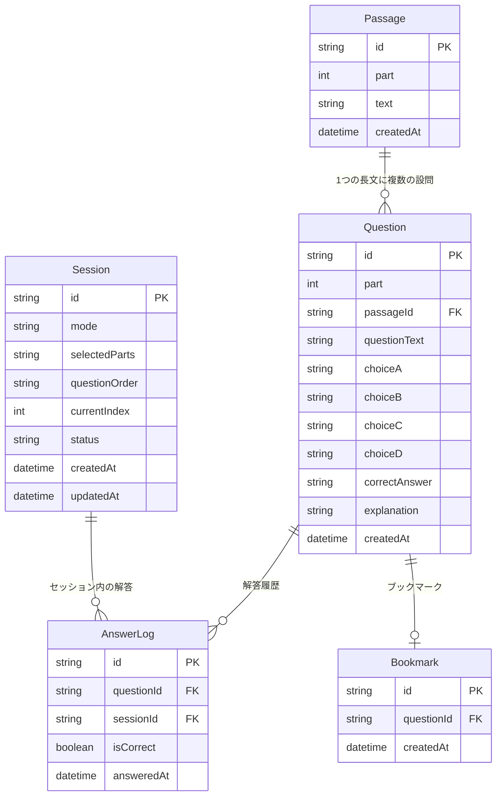

# TOEIC-drill 詳細設計書(内部設計)

- 文書ステータス: ドラフト(ユーザー確認待ち)
- 作成日: 2026-07-31
- 前提: [01_requirements.md](./01_requirements.md) / [02_basic_design.md](./02_basic_design.md) の内容に基づく

## 1. 問題データCSVファイル仕様

### 1.1 基本仕様

| 項目 | 内容 |
|---|---|
| 拡張子 | `.csv` |
| 文字コード | UTF-8(BOM付き・BOMなし両方許容。ExcelはBOM付きで保存されることが多い) |
| 区切り文字 | カンマ(`,`) |
| 改行・カンマを含む値 | ダブルクォート `"` で囲む(標準CSVエスケープ) |
| ヘッダー行 | 必須(1行目は列名) |
| 問題ID | ファイルには含めない。アップロード時にシステムが自動採番する |

### 1.2 列(カラム)定義

| 列名 | 必須 | 内容 | 例 |
|---|---|---|---|
| `part` | ○ | Part番号。`5` / `6` / `7` のいずれか | `5` |
| `passage_id` | Part6/7のみ | 長文を共有する設問に同じ値を入れる。Part5は空欄。同じ長文内で一意であればよい(例: `p1`, `p2`...重複しなければ形式自由) | `p1` |
| `passage_text` | Part6/7のみ | 長文本文。同じ`passage_id`の行にはすべて同じ内容を入力する(繰り返し入力) | `Dear Mr. Smith, ...` |
| `question_text` | ○ | 設問文 | `What is the purpose of the letter?` |
| `choice_a` | ○ | 選択肢A | `To request a refund` |
| `choice_b` | ○ | 選択肢B | |
| `choice_c` | ○ | 選択肢C | |
| `choice_d` | ○ | 選択肢D | |
| `correct_answer` | ○ | 正解。`A`/`B`/`C`/`D`のいずれか(大文字) | `B` |
| `explanation` | 任意 | 解説。空欄可 | `本文2文目に...とあるため正解はB` |

### 1.3 サンプル(Part5・Part7混在の例)

```csv
part,passage_id,passage_text,question_text,choice_a,choice_b,choice_c,choice_d,correct_answer,explanation
5,,,"The manager asked staff to ------ the new policy immediately.","follow","following","followed","follows",A,"命令文の動詞の後は原形が入るためA"
7,p1,"Dear Mr. Smith, Thank you for your inquiry about our new product line...","What is the main purpose of this letter?","To confirm an order","To respond to an inquiry","To apologize for a delay","To request payment",B,
7,p1,"Dear Mr. Smith, Thank you for your inquiry about our new product line...","What will Mr. Smith probably receive next week?","A refund","A catalog","An invoice","A discount coupon",B,
```

### 1.4 アップロード時のバリデーションルール

1. ヘッダー行の列名が仕様通りであること(過不足があればエラー)
2. `part` は `5`/`6`/`7` のいずれかであること
3. `question_text`・`choice_a`〜`choice_d`・`correct_answer` が空でないこと
4. `correct_answer` は `A`/`B`/`C`/`D` のいずれかであること
5. `part` が `6` または `7` の場合、`passage_id` と `passage_text` が空でないこと
6. 同じ `passage_id` を持つ行同士は `passage_text` が一致していること(不一致の場合はエラーとし、行番号を提示する)
7. ファイル内に1件でもエラー行があった場合、ファイル全体を登録しない(1行も登録せず、全件ロールバックする)。画面にはエラーがあった行番号と理由を一覧表示し、ユーザーがファイルを修正して再アップロードする

## 2. データベース設計

### 2.1 ER図



### 2.2 Prismaスキーマ(実装イメージ)

```prisma
model Passage {
  id        String     @id @default(cuid())
  part      Int
  text      String
  createdAt DateTime   @default(now())
  questions Question[]
}

model Question {
  id            String      @id @default(cuid())
  part          Int
  passageId     String?
  passage       Passage?    @relation(fields: [passageId], references: [id])
  questionText  String
  choiceA       String
  choiceB       String
  choiceC       String
  choiceD       String
  correctAnswer String
  explanation   String?
  createdAt     DateTime    @default(now())
  answerLogs    AnswerLog[]
  bookmark      Bookmark?
}

model AnswerLog {
  id         String   @id @default(cuid())
  questionId String
  question   Question @relation(fields: [questionId], references: [id], onDelete: Cascade)
  sessionId  String?
  session    Session? @relation(fields: [sessionId], references: [id])
  isCorrect  Boolean
  answeredAt DateTime @default(now())
}

model Bookmark {
  id         String   @id @default(cuid())
  questionId String   @unique
  question   Question @relation(fields: [questionId], references: [id], onDelete: Cascade)
  createdAt  DateTime @default(now())
}

model Session {
  id            String      @id @default(cuid())
  mode          String      // "normal" | "bookmark_review"
  selectedParts String      // 例: "[5,6]" (JSON文字列)
  questionOrder String      // 出題順の問題ID配列 (JSON文字列)
  currentIndex  Int         @default(0)
  status        String      // "in_progress" | "completed" | "abandoned"
  createdAt     DateTime    @default(now())
  updatedAt     DateTime    @updatedAt
  answerLogs    AnswerLog[]
}
```

補足:
- `Bookmark` は「不正解になった問題」を表す。復習セッションで正解すると該当レコードを削除する
- `Session.questionOrder` に出題順(問題IDの配列)をJSON文字列として保持することで、ランダム出題の順序を固定し「続きから再開」を実現する
- `Session.currentIndex` が現在の出題位置。中断時はこの値を保存し、再開時に同じ位置から再開する

## 3. 問題データの編集・削除仕様

### 3.1 編集(S-08 問題編集画面)
- `Question` の全項目(`part`・`questionText`・`choiceA`〜`choiceD`・`correctAnswer`・`explanation`)を編集可能とする
- `passageText`(長文)を編集した場合は、紐づく `Passage` レコードを更新する。これにより同じ `passageId` を共有する他の設問にも変更が反映される(長文は`Passage`テーブルで一元管理しているため、二重管理にならない)
- `part` を変更する場合、Part5⇔Part6/7間の変更は長文(`passageId`)の有無が変わるため、UIで警告を出す(例: Part5からPart7に変更する場合は長文の入力を必須にする)

### 3.2 削除(S-07 問題一覧画面)
- **個別削除**: 対象の `Question` を削除する。`AnswerLog`・`Bookmark` は `onDelete: Cascade` により連動して削除される。紐づく `Passage` は、他に参照している `Question` が存在しなければあわせて削除し、存在すれば残す
- **Part単位一括削除**: 指定した `part` に属するすべての `Question` を削除する(個別削除と同じ連動削除ルールを一括適用)。実行前に確認ダイアログで対象件数を表示する
- 削除は取り消せないため、実行前に必ず確認ダイアログを表示する

## 4. ダッシュボード表示項目の算出ロジック

| 表示項目 | 算出方法 |
|---|---|
| 累計回答数 | `AnswerLog` の件数 |
| 累計正答率 | `AnswerLog` のうち `isCorrect=true` の件数 ÷ 全件数 |
| ブックマーク数(未解決の誤答数) | `Bookmark` の件数 |
| 直近の学習日 | `AnswerLog.answeredAt` の最大値 |
| 登録問題数(Part別内訳) | `Question` を `part` でグループ化して件数集計 |
| 進行中セッションの有無 | `Session.status = "in_progress"` のレコードが存在するか |

## 5. ディレクトリ構成(実装イメージ)

```
toeic-drill/
├─ docs/                      # ウォーターフォール各工程のドキュメント
├─ prisma/
│  └─ schema.prisma
├─ src/
│  ├─ app/
│  │  ├─ page.tsx             # S-01 ダッシュボード
│  │  ├─ quiz/
│  │  │  ├─ setup/page.tsx    # S-02 出題設定
│  │  │  ├─ play/page.tsx     # S-03 出題画面
│  │  │  └─ result/page.tsx   # S-04 セッション終了
│  │  ├─ bookmarks/page.tsx   # S-05 ブックマーク一覧・復習
│  │  └─ questions/
│  │     ├─ manage/page.tsx   # S-06 問題データ管理
│  │     ├─ page.tsx          # S-07 問題一覧
│  │     └─ [id]/edit/page.tsx  # S-08 問題編集
│  ├─ components/             # UIコンポーネント
│  ├─ lib/
│  │  ├─ db.ts                # Prisma Clientの初期化
│  │  ├─ csv-import.ts        # CSVパース・バリデーション
│  │  └─ session.ts           # 出題セッションのロジック
│  └─ types/
├─ package.json
└─ tsconfig.json
```

## 6. 未確定事項

現時点で残っている未確定事項はなし。実装を進める中で新たな論点が出た場合はここに追記する。
